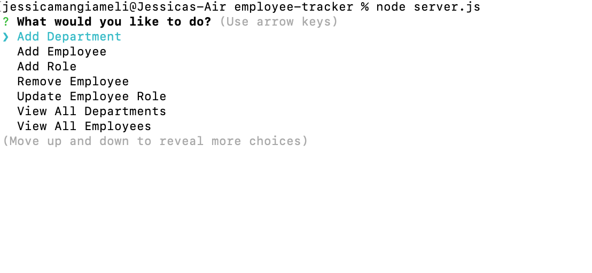

# employee-tracker

This application keeps records of a company's employees. It is used through the command line.

link to demo video:
https://drive.google.com/file/d/1kc6pHA_3wI_ZARhiv-hDOMlQg3BTeoHr/view

## Installation

* Clone this repository to your computer

on the command line in terminal run the following:

* npm install inquirer

* npm install mysql

* npm install console.table

Open MySQL workbench

- run et.sql to create the database and tables

- run seed.sql to populate the tables with information

Open server.js and enter your MySQL root password on line 9 and save

On the command line in terminal run the following to execute the app:

* node server.js

